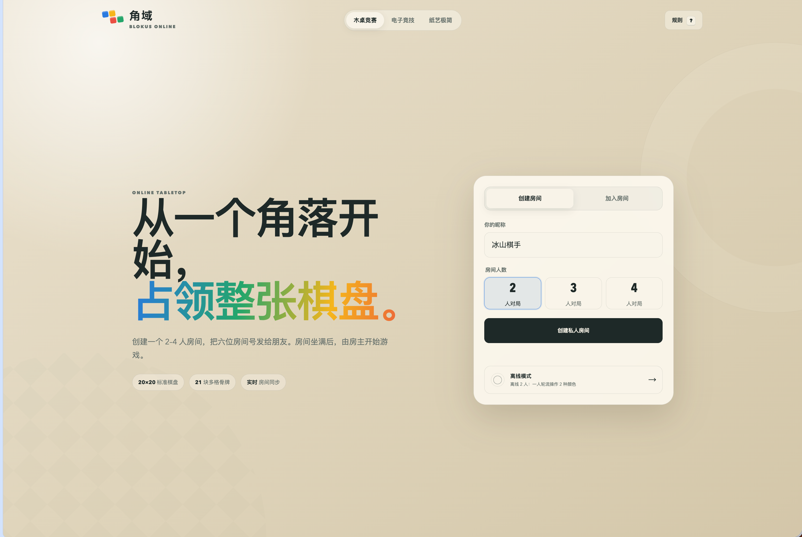
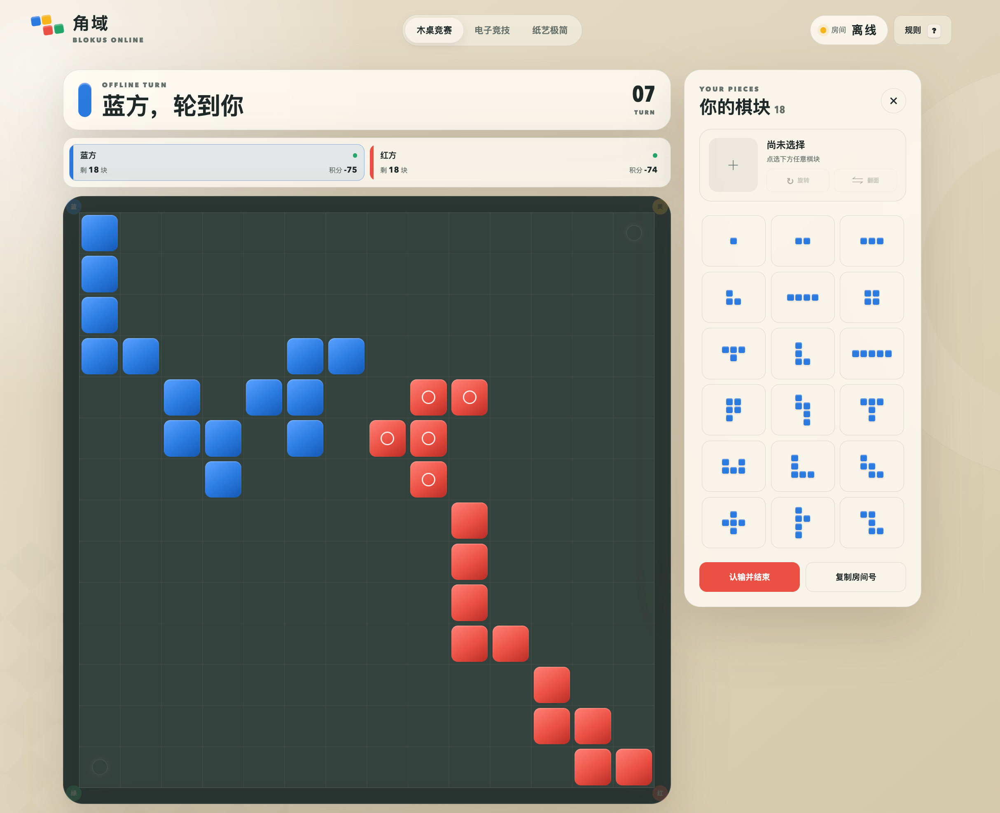

# 角域 · Blokus Online

支持 2–4 名玩家通过六位房间号加入的网页版角斗士棋。服务端使用 Python 标准库，无第三方运行依赖。

## 本地运行

```bash
python3 server/app.py --host 127.0.0.1 --port 4173
```

打开 <http://127.0.0.1:4173/>。

## 测试

```bash
python3 -m unittest discover -s tests -v
node --check game.js
python3 -m py_compile server/app.py server/game_engine.py
```

## 线上结构

- 静态文件：`/var/www/html/blokus`
- 房间服务：`127.0.0.1:8790`
- systemd：`blokus.service`
- Nginx 将 `/blokus/` 映射到静态文件，并将 `/blokus/api/` 代理到房间服务。

房间状态当前保存在服务进程内存中。服务重启后未结束的房间会失效；持久化和多实例扩展应在出现实际需求后加入。

房间按最后一次有效状态更新自动过期：等待中 2 小时、游戏中 24 小时、已结束 1 小时。网页保持实时连接不会无限延长房间寿命；过期时服务端会关闭对应 SSE 连接，客户端随后返回大厅。

服务端限制全局活跃房间数，并限制同一来源 IP 同时创建的活跃房间，避免匿名用户在过期窗口内无限占用资源。

部署脚本要求显式传入站点域名，仓库不保存具体环境的域名：

```bash
sudo python3 deployment/install.py --source . --domain example.com
python3 tests/public_smoke.py https://example.com/blokus/api
```

## 模式

- 在线模式：通过房间号加入 2–4 人房间，并实时同步当前玩家的棋块选择与半透明落点预览。
- 离线模式：选择 2–4 人，一人轮流操作对应数量的颜色，不依赖服务器。

## 截图

### 在线大厅



### 离线对局



## 单文件离线版

`offline.html` 已将页面、样式和棋块数据全部内嵌，不包含服务器代码或网络请求。下载后直接双击即可开始离线游戏。

重新生成单文件版本：

```bash
python3 tools/build_offline.py
```
